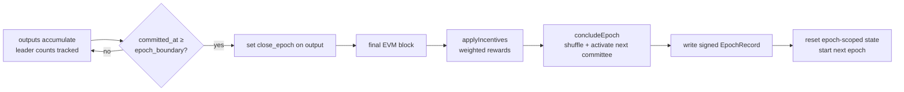
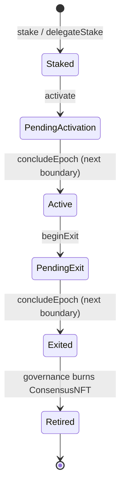

# Telcoin Network: A Technical Protocol Whitepaper

> **Status:** Working draft. This document describes the protocol as implemented in this
> repository. Section sources cite the files the descriptions are drawn from; where the
> in-flight `peer-rpc-info` branch changes behaviour, it is called out explicitly.
>
> **Audience:** protocol engineers and researchers. The emphasis is on correctness,
> determinism, and the trade-offs of each design choice — not on adoption or mission.

---

## Abstract

Telcoin Network (TN) is an EVM-compatible Layer 1 blockchain whose novelty is not any single
component but the *composition* of three ideas that are normally solved in isolation:

1. **A DAG-structured BFT mempool and ordering engine** (Narwhal data availability +
   Bullshark ordering) that decouples transaction *dissemination* from transaction *ordering*,
   removing the single-leader mempool bottleneck of classical BFT and Nakamoto chains.
2. **A tight, deterministic coupling to a full EVM execution layer** (Reth), where every
   committed sub-DAG deterministically produces canonical EVM blocks and consensus metadata is
   embedded directly into EVM header fields as a verifiable audit trail.
3. **On-chain, epoch-scoped governance and economics**, where committee rotation, reward
   issuance, and validator lifecycle transitions are executed *by the protocol itself* through
   deterministic system calls at atomic epoch boundaries.

The unifying viability argument is **determinism end-to-end**: every honest validator
independently re-derives the identical EVM chain, the identical committee shuffle, and the
identical reward distribution from the identical consensus output. Determinism, combined with
**bounded resource use** (epoch-scoped state rotation) and **Byzantine resilience** (2f+1
quorums, committee-gated networking, crash-recovery replay), is what lets TN claim safety and
liveness without probabilistic settlement.

*Sources: `README.md`, `Cargo.toml`.*

---

## 1. Introduction

### 1.1 The problem

Leader-based blockchains — both Nakamoto-style (Bitcoin) and classical-BFT/single-proposer
designs (most Ethereum-consensus variants) — share a structural bottleneck: **one proposer at
a time is responsible for both selecting and ordering transactions.** This couples total
system throughput to the bandwidth and liveness of a single node per slot. Worse, the same
transaction data is frequently re-disseminated during the ordering protocol, so the network
pays for each transaction's bandwidth multiple times.

The bottleneck is not the cryptography or the state machine; it is the *coupling of
dissemination to ordering*. If a single node must receive, propose, and order all transactions,
horizontal scaling is impossible — adding validators adds verification cost without adding
proposing capacity.

### 1.2 The TN solution, in one paragraph

TN separates the two concerns. **Workers** continuously disseminate batches of transactions and
prove their availability (a 2f+1 quorum has stored each batch) *before* ordering begins.
**Primaries** then run a DAG-based BFT protocol whose vertices reference already-available
batches by digest — so the ordering protocol moves only small references, never transaction
bodies. A deterministic ordering rule (Bullshark) linearizes the DAG into a totally-ordered
stream of sub-DAGs. Each committed sub-DAG is handed to a **Reth-based execution engine** that
deterministically materializes it into canonical EVM blocks. At fixed time boundaries
(**epochs**), the protocol executes on-chain system calls that pay rewards and rotate the
validator committee — atomically, in the epoch's final block.

### 1.3 Contributions / what is novel relative to prior work

TN inherits its consensus core from the Narwhal/Bullshark lineage (Sui/Mysten Labs). The
contributions that distinguish TN are:

- **Deterministic DAG-to-EVM materialization** (§4): a one-batch-to-one-block mapping in which
  consensus provenance is encoded into otherwise-unused EVM header fields, making the
  consensus↔execution linkage independently verifiable from the block alone.
- **Protocol-executed, on-chain epoch governance** (§5): committee rotation, reward issuance,
  and validator lifecycle are not off-chain operator actions but deterministic system calls
  run inside the EVM at atomic epoch boundaries, seeded by consensus randomness.
- **Committee-gated networking with an explicit Byzantine penalty model** (§6): only the
  current committee may publish on restricted gossip topics, and peer behaviour is scored on a
  bounded reputation scale with graduated penalties.
- **Epoch-scoped storage rotation** (§7): consensus-DB growth is bounded because the
  round/vote/certificate tables are cleared every epoch, while an append-only, CRC-checked
  archive preserves auditable history.

*Sources: `README.md`, `Cargo.toml`.*

---

## 2. System Model & Protocol Overview

### 2.1 Actors and roles

A **validator** runs one **primary** and one or more **workers**:

- **Worker** — collects transactions from its RPC/transaction pool, seals them into batches,
  proves availability to a quorum, and serves batch data to other workers.
- **Primary** — proposes headers that reference available batches and parent certificates,
  votes on peers' headers, aggregates votes into certificates, and runs Bullshark ordering.

Nodes operate in one of three **modes** (`NodeMode`, `crates/consensus/primary/src/consensus_bus.rs`):

| Mode | Participates in consensus? | Purpose |
|------|----------------------------|---------|
| `CvvActive` | Yes | Fully-synced committee voting validator (normal state) |
| `CvvInactive` | No (catching up) | A committee member that crashed/fell behind and is syncing past the GC window to rejoin |
| `Observer` | No | Follows and executes consensus output without voting; may or may not be staked |

All three modes execute the same `ConsensusOutput` stream; only `CvvActive` nodes produce
headers, votes, and certificates.

### 2.2 Node anatomy

The long-lived coordinator is the **`EpochManager`** (`crates/node/src/manager/node.rs`). It
owns resources that outlive any single epoch — the Reth database, the consensus archive
(`ConsensusChain`), and the application-lifetime channel hub (`ConsensusBusApp`) — and drives
the per-epoch lifecycle: spawn primary + workers, forward consensus output to the engine, wait
for the epoch boundary, write the epoch record, reset epoch-scoped channels, and start the next
epoch.

```mermaid
flowchart TB
    subgraph Validator Node
        EM[EpochManager<br/>long-lived coordinator]
        subgraph Per-epoch tasks
            W[Worker(s)<br/>batch production]
            P[Primary<br/>headers / votes / certs / Bullshark]
            EX[ExecutorEngine<br/>Reth / EVM]
        end
        BUS[ConsensusBusApp<br/>broadcast + watch channels]
        CDB[(Consensus DB<br/>+ archive)]
        RDB[(Reth DB<br/>EVM state)]
        NET[libp2p networks<br/>primary + worker]
    end
    EM --- BUS
    W --> P --> EX
    P <--> NET
    W <--> NET
    P --- CDB
    EX --- RDB
    EX -- recent blocks --> BUS --> P
```

### 2.3 Fault and timing model

- **Replication:** `n = 3f + 1` authorities tolerate `f` Byzantine faults.
- **Quorum (2f+1):** `quorum_threshold = ⌊2n/3⌋ + 1` (`crates/types/src/committee.rs`).
- **Validity (f+1):** `validity_threshold = ⌈n/3⌉` — the "at least one honest" threshold.
- **Voting power:** equal. `EQUAL_VOTING_POWER = 1`; every committee member has exactly one
  vote. The `VotingPower` type exists for generality but is uniformly `1` today.
- **Timing:** partial synchrony. Safety holds always; liveness holds after GST. Epoch
  boundaries are **time-based** (wall-clock `epochDuration`), not height-based.
- **Identity:** BLS12-381 keys (via `blst`). An `AuthorityIdentifier` is the hash of the BLS
  public key. Consensus objects are hashed with Blake3; EVM objects with keccak256.

### 2.4 The keystone data flow

The single most important figure in the paper: how a transaction becomes a canonical block.

```mermaid
flowchart LR
    TX[tx] --> POOL[worker tx pool]
    POOL --> BATCH[Batch<br/>worker seals + QuorumWaiter 2f+1]
    BATCH -->|digest| HDR[Header<br/>primary: refs batches + parent certs]
    HDR --> VOTE[Votes<br/>2f+1 BLS signatures]
    VOTE --> CERT[Certificate<br/>aggregated signature]
    CERT --> DAG[DAG of certificates]
    DAG --> COMMIT[Bullshark commit<br/>CommittedSubDag]
    COMMIT --> OUT[ConsensusOutput]
    OUT -->|broadcast ch| EM2[EpochManager]
    EM2 -->|mpsc to_engine| ENG[ExecutorEngine]
    ENG --> BLK[canonical EVM block(s)]
    BLK -. recent-blocks watch .-> HDR
```

Concretely (channel types verified against the code):

1. A worker seals a `Batch` and the `QuorumWaiter` waits for 2f+1 acknowledgments before the
   batch counts as *available*.
2. The primary `Proposer` builds a `Header` referencing available batch digests
   (`payload: IndexMap<BlockHash, WorkerId>`) and parent certificates.
3. Peers return `Vote`s; the `VotesAggregator` forms a `Certificate` once 2f+1 voting power
   signs, aggregating the BLS signatures.
4. Certificates form a DAG; Bullshark linearizes committed leaders into `CommittedSubDag`s.
5. The executor `Subscriber` wraps each sub-DAG (plus its batch transaction data) into a
   `ConsensusOutput` and publishes it on the `consensus_output` **broadcast** channel
   (capacity 100).
6. The `EpochManager` subscribes to that broadcast, and forwards each output over a bounded
   **mpsc** channel (`to_engine`, capacity 1000) to the `ExecutorEngine`.
7. The engine produces canonical EVM blocks and feeds execution progress back to the primary
   via the `recent_blocks` **watch** channel, so future headers can reference the latest
   executed block.

The mix of channel kinds is deliberate: **broadcast** so every node mode sees the same output;
**mpsc** to the engine for backpressure; **watch** for "latest value wins" execution feedback.

*Sources: `crates/node/src/manager/node.rs`, `crates/node/src/lib.rs`,
`crates/consensus/primary/src/consensus_bus.rs`, `crates/consensus/executor/src/subscriber.rs`,
`crates/types/src/primary/output.rs`.*

### 2.5 Notation

| Term | Meaning |
|------|---------|
| `f` | maximum Byzantine validators; `n = 3f+1` |
| Quorum | 2f+1 voting power (certificate formation, batch availability) |
| Validity | f+1 voting power (leader commit support, "≥1 honest") |
| Round | a primary DAG round (`u32`); headers/certs are per-round |
| Epoch | a time-bounded committee term; resets epoch-scoped state |
| Certificate | a header + aggregated 2f+1 BLS signatures |
| Sub-DAG | the certificates ordered by one committed leader |
| Leader | the round's deterministically-elected anchor (even rounds) |

---

## 3. Consensus Layer — Foundation (Derived Prior Work)

> This section is intentionally a *foundation*, not the novelty centerpiece. It gives enough
> Narwhal/Bullshark to make §§4–7 legible, cites the Sui origin honestly, and emphasizes the
> TN-specific deltas. It can be promoted to a deep section if a stronger novelty claim about
> the ordering layer is desired (see *Open decisions*).

### 3.1 Narwhal mempool: availability before ordering

**Worker batch flow.** A worker seals transactions into a `SealedBatch { batch, digest }`. The
`QuorumWaiter` (`crates/consensus/worker/src/quorum_waiter.rs`) broadcasts the batch to peer
workers and accumulates acknowledgments weighted by voting power until it reaches
`committee.quorum_threshold()` (2f+1). Only then is the batch *available* and its digest
eligible to appear in a primary header. An anti-quorum guard (`max_rejected_stake`) lets the
waiter fail fast when enough stake has rejected the batch that quorum is impossible.

This is the crux of Narwhal: **transaction bodies are disseminated and proven available before
consensus runs**, so the ordering protocol never moves transaction payloads — only 32-byte
digests.

### 3.2 Primary: headers, votes, certificates

A `Header` (`crates/types/src/primary/header.rs`) carries the author, round, epoch, a
`payload` map of available batch digests to worker IDs, a `parents` set of round-(r−1)
certificate digests, and the latest known execution block. Peers validate the header and
return a `Vote` signed with their BLS key.

The `VotesAggregator` (`crates/consensus/primary/src/aggregators/votes.rs`) verifies each vote
signature, rejects equivocation (tracking `authorities_seen`), and accumulates voting power.
At 2f+1 it aggregates the individual BLS signatures into one
(`BlsAggregateSignature::aggregate`) and emits a `Certificate` whose `signed_authorities` is a
roaring bitmap of signers. A certificate is therefore a *succinct proof that 2f+1 validators
attested to a header that referenced available data*.

### 3.3 Proposer round structure

The `Proposer` (`crates/consensus/primary/src/proposer.rs`) advances rounds under conditions
designed to keep the DAG dense enough for Bullshark to commit:

- It waits between a `min_header_delay` (default 1000 ms) and `max_header_delay`
  (default 2500 ms), with batch-count thresholds to propose early when full.
- The delays are *leader-aware*: if this node is **not** the next round's leader, `min` delay
  is reduced toward zero (publish promptly); if it **is** the next leader, `max` delay is
  halved (accelerate the leader's inclusion).
- A round advances when parents are present and either the leader certificate is among the
  parents (even→odd) or enough votes (f+1) confirm the leader will/won't arrive (`enough_votes`).

### 3.4 Bullshark ordering

Leaders are elected **only on even rounds**: `leader(r) = authorities[(r/2 − 1) mod n]`,
subject to reputation-based swaps (below).

**Commit rule (as implemented in `bullshark.rs`).** A leader `L` at even round `r` is committed
when the certificates at round `r+1` that reference `L` as a parent carry at least
**`validity_threshold()` (f+1)** voting power:

```text
support(L) = Σ voting_power(c.origin)
             for c in dag[r+1] where L.digest ∈ c.parents
if support(L) < validity_threshold():   # f+1
    return NotEnoughSupportForLeader     # try again next even round
else:
    order_leaders(L)        # walk back to last committed leader, collect linked leaders
    for each ordered leader: order_dag(leader)  # flatten its causal history (DFS)
    emit CommittedSubDag { certificates, leader, reputation_score, commit_timestamp }
```

> **Note on the threshold.** TN follows the Sui Bullshark implementation here: the *direct*
> commit support for the anchor is `f+1`, which guarantees at least one honest certificate
> references the leader and therefore that the leader is in the causal history of all future
> leaders. This is distinct from the 2f+1 used for *certificate formation* and *batch
> availability*. Do not conflate the two thresholds.

Once a leader commits, all earlier *uncommitted* leaders that are linked to it commit
transitively, and each leader's sub-DAG is flattened into a deterministic certificate sequence.
Determinism of `order_dag` is what guarantees every honest node produces byte-identical output.

**Reputation and leader swaps.** After each commit window, `ReputationScores` credit
certificates that supported the previous leader. Every `num_sub_dags_per_schedule` commits, a
new `LeaderSwapTable` (`leader_schedule.rs`) swaps the `f` worst-scoring authorities out of the
leader rotation in favour of the `f` best — deterministically, so the schedule itself never
forks.

### 3.5 Safety and liveness intuition

- **No fork:** ordering is a deterministic function of the DAG; the f+1 commit support ensures
  every committed leader is in all future leaders' causal past, so two honest nodes can never
  commit conflicting orders.
- **Deterministic finality:** a committed sub-DAG is final — there is no probabilistic
  reorg window as in Nakamoto consensus.
- **Liveness:** under partial synchrony, the leader-aware proposer delays and the timeout-based
  round advancement guarantee eventual leader commits.

### 3.6 TN-specific deltas (relative to Sui Narwhal/Bullshark)

- **BLS12-381 everywhere**, with `IntentMessage` scoping to prevent cross-context signature
  reuse.
- **Equal voting power** (`EQUAL_VOTING_POWER = 1`) — quorums are validator counts, not stake
  fractions.
- **Epoch coupling:** committee identity is tied to an on-chain registry; an `EpochRecord`
  chains epochs together and is certified by a quorum of the prior committee.
- **Execution awareness:** headers carry `latest_execution_block`, threading EVM progress into
  consensus (used by §4's feedback loop).

*Sources: `crates/consensus/primary/src/consensus/{bullshark,state,leader_schedule}.rs`,
`crates/consensus/primary/src/{proposer,certifier}.rs`,
`crates/consensus/primary/src/aggregators/votes.rs`, `crates/consensus/worker/src/`,
`crates/types/src/primary/{header,vote,certificate,output}.rs`, `crates/types/src/committee.rs`.*

---

## 4. Execution Layer (Reth / EVM) — Deep

This is the first novelty centerpiece: how a totally-ordered consensus stream deterministically
becomes a canonical EVM chain, and how consensus provenance is welded into the block itself.

### 4.1 The consensus→execution boundary

The `ExecutorEngine` (`crates/engine/src/lib.rs`) is a futures-based state machine that
consumes `ConsensusOutput` from a `tokio::sync::mpsc::Receiver`. Each `ConsensusOutput` is
flattened into `(certificate_index, batch_index)` pairs (`output.flatten_batches()`), and
**each `Batch` becomes exactly one EVM block** (`crates/engine/src/payload_builder.rs`).

Two boundary cases matter for determinism:

- **Empty output, epoch not closing** → execution is skipped entirely; the canonical header is
  unchanged (the leader count is still incremented for reward accounting).
- **Empty output, epoch closing** → exactly one empty block is produced so the epoch-boundary
  system calls (§5) have a block to run in.

### 4.2 `TNPayload`: the consensus→EVM contract

`TNPayload` (`crates/tn-reth/src/payload.rs`) is the typed hand-off from consensus to the Reth
block builder. It carries the parent header, beneficiary (the batch's worker beneficiary),
nonce, batch index, timestamp, batch digest, consensus-header digest, base fee, gas limit, mix
hash, an optional `close_epoch` marker, and worker ID. The block builder consumes a `TNPayload`
and produces one sealed EVM block via `RethEnv::build_block_from_batch_payload()`.

### 4.3 Header-field repurposing as a verifiable audit trail

A distinctive TN design point: because execution is a deterministic replay of consensus, the
EVM header's traditionally-PoW fields are free to carry **consensus provenance**. Every
encoding below is verified against the implementation.

| EVM header field | Encoding | Meaning |
|------------------|----------|---------|
| `nonce` | `(epoch << 32) \| round` | epoch in high 32 bits, round in low 32 (`header.rs`) |
| `mix_hash` | `output_digest XOR batch_digest` (or `output_digest` if no batches) | binds the block to its sub-DAG output and batch |
| `difficulty` | `batch_index << 16 \| worker_id` | worker in low 16 bits, batch index above (`evm/config.rs`) |
| `ommers_hash` | `batch_digest` (or `B256::ZERO`) | the executed batch's digest |
| `parent_beacon_block_root` | `consensus_header_digest` | the consensus header that committed these txs |
| `extra_data` | `keccak256(leader_BLS_aggregate_sig)` at epoch boundary, else empty | epoch-boundary marker + on-chain randomness source |

The payoff: **the consensus↔execution linkage is independently verifiable from the block
alone.** Anyone with the block can recover the epoch, round, worker, batch index, and the
consensus header that produced it, and check it against consensus data — no side channel
needed. The `extra_data` field doubles as the randomness beacon for the committee shuffle (§5).

### 4.4 Base-fee model

The base fee is **per-worker, per-epoch**. The `GasAccumulator`
(`crates/types/src/gas_accumulator.rs`) holds per-worker `GasTotals` and an atomic
`BaseFeeContainer` shared between the batch builder and the accumulator, so a fee update is
visible immediately to all holders. Each batch carries its own `base_fee_per_gas`; the fee is
not re-derived during execution but validated per worker.

On restart, three layers reconstruct the accumulator deterministically:

1. **`catchup_accumulator`** walks already-executed Reth blocks for the current epoch,
   re-accumulating per-worker gas stats and restoring leader counts from the consensus DB.
2. **`replay_missed_consensus`** re-executes consensus output that was committed but not yet
   executed, filling the gap through the normal payload-builder path.
3. **`run_epoch`** (in `Initial`/`NewEpoch` modes) invokes the replay before the live loop, so
   no rounds are skipped or double-counted.

### 4.5 Reth integration surface

`RethEnv` (`crates/tn-reth/src/lib.rs`) wraps Reth's provider factory, EVM config, and database.
`TnEvmConfig` implements Reth's `ConfigureEvm`; `TNBlockExecutor` and `TNBlockAssembler` run
pre-execution system hooks (EIP-4788 beacon root on the first batch, EIP-2935 block hashes),
recover transaction senders in parallel (rayon) then execute sequentially, and assemble the
sealed block. Invalid individual transactions are non-fatal (logged and skipped); executor-level
errors are fatal. Full EVM compatibility means existing Ethereum tooling and contracts work
unchanged.

### 4.6 Why viable — strengths and trade-offs

- **Full EVM compatibility:** no bespoke VM; the entire Ethereum tooling ecosystem applies.
- **Determinism:** every validator re-derives byte-identical blocks from the identical sub-DAG;
  embedded metadata makes the derivation auditable.
- **Trade-offs:** one-block-per-batch shaping; a single base fee per worker today (a roadmap
  item is parallel per-worker fees); header fields are reserved for protocol use, so they are
  unavailable for other purposes.

*Sources: `crates/engine/README.md`, `crates/engine/src/{lib,payload_builder}.rs`,
`crates/tn-reth/README.md`, `crates/tn-reth/src/{payload,lib}.rs`,
`crates/tn-reth/src/evm/{block,config}.rs`, `crates/types/src/gas_accumulator.rs`,
`crates/types/src/primary/output.rs`, `crates/batch-builder/README.md`.*

---

## 5. Epochs & Validator Lifecycle — Deep

The second novelty centerpiece: protocol-executed, on-chain, deterministic governance and
economics at atomic boundaries.

### 5.1 Epoch definition and boundary detection

An epoch is a wall-clock term of length `epochDuration` (seconds, from `EpochInfo` in
`ConsensusRegistry.sol`). The `EpochManager` computes `epoch_boundary = epoch_start +
epochDuration` and, in `wait_for_epoch_boundary`, watches each output's commit timestamp. When
`output.committed_at() >= epoch_boundary`, that output is marked as the epoch's last by setting
its `close_epoch` flag.

### 5.2 Atomic transition mechanics

The `close_epoch` flag rides on the final `ConsensusOutput` and produces a final EVM block in
which the boundary system calls run **inside a single EVM transaction context**:

1. `applyIncentives(rewardInfos)` — pay validators by weight.
2. `concludeEpoch(newCommittee)` — activate the next committee.

Because both run in one block, the transition is **all-or-nothing**: if either reverts, the
block fails, the epoch does not close, and the node halts rather than committing a partial
transition. This is the structural defense against split-brain / partial-rotation forks.



### 5.3 System contracts (fixed addresses)

| Contract | Address | Role |
|----------|---------|------|
| `ConsensusRegistry` | `0x07E1…17e1` | validators, committees, epoch state, rewards |
| `Issuance` | `0x07A0…07A0` | holds TEL for reward distribution |
| system caller | `0xffff…fffe` | the trusted internal caller for system calls |

### 5.4 System calls and their status

- **`applyIncentives(RewardInfo[])`** — active. Each `RewardInfo` is
  `{ validatorAddress, consensusHeaderCount }`. Computes per-validator weight and distributes
  issuance (§5.6).
- **`concludeEpoch(address[] newCommittee)`** — active. Advances the epoch ring buffer,
  increments `currentEpoch`, and installs the shuffled committee.
- **`applySlashes(Slash[])`** — **defined but not invoked** (disabled during the current
  pilot). When enabled it would decrement validator balances and eject on depletion.

### 5.5 Deterministic committee shuffle

The next committee is chosen by a **Fisher-Yates shuffle seeded by consensus randomness**.
The seed is `keccak256(leader.aggregated_signature())` — the same value placed in the boundary
block's `extra_data` (§4.3). In `shuffle_new_committee` (`crates/tn-reth/src/evm/block.rs`):

```text
seed       = keccak256(leader_BLS_aggregate_signature)   # B256
rng        = StdRng::from_seed(seed)
active     = registry.getValidators(Active)              # minus PendingExit
if active.len() < committee_size:
    active += choose_multiple(pending_exit, missing, rng)
fisher_yates_shuffle(active, rng)                          # in-place
committee  = sort(active[..committee_size])               # deterministic order
```

Because the seed is a BLS aggregate signature that every node already agrees on, **every
validator (and the chain itself) computes the identical next committee with no extra
coordination round.** The shuffle is verifiable on-chain inside `concludeEpoch`.

### 5.6 Token economics (protocol view)

Per epoch, `epochIssuance` TEL is distributed to validators by **weight**:

```text
weight(v)      = stakeAmount(v) × consensusHeaderCount(v)     # leader-block count
totalAvailable = epochIssuance + undistributedIssuance        # carried-forward dust
reward(v)      = totalAvailable × weight(v) / Σ weight        # integer division
undistributedIssuance = totalAvailable − Σ reward(v)          # rolls to next epoch
```

Two correctness properties: rewards scale with *both* stake and consensus contribution
(leader-block count), and integer-division **dust rolls forward** via `undistributedIssuance`,
so no TEL is ever lost.

### 5.7 Validator lifecycle state machine



The `ConsensusNFT` is a non-transferable (soulbound) ERC-721 minted and burned only by
governance; it is the permission token that gates validator participation. State transitions
into and out of the active set happen *only at epoch boundaries*, via `concludeEpoch`.

### 5.8 Restart and recovery

`RunEpochMode` distinguishes startup paths: `Initial` and `NewEpoch` replay missed consensus
before the live loop; `ModeChange` (e.g. a CVV demoted to observer, or mid-sync) skips the
replay because the consensus DB is not authoritative for it. Epochs are chained by
`EpochRecord`, validated by the invariant **`prev.next_committee == current.committee`** — a
mismatch indicates corrupted or forked state and halts the node. A dummy epoch-0 record is
written on first startup so epoch-record lookups are always well-defined.

### 5.9 Why viable — strengths and trade-offs

- **On-chain, deterministic governance and economics:** verifiable, no off-chain trust.
- **Atomic boundaries:** eliminate partial-transition fork risk by construction.
- **No value leakage:** dust carried forward.
- **Restart safety:** replay + epoch-record validation.
- **Trade-offs:** the committee is permissioned (governance-gated NFT); boundaries are
  time-based, so epoch length is a tuned parameter rather than an adaptive one; slashing is
  defined but not yet active.

*Sources: `crates/node/src/manager/node/epoch.rs`, `crates/tn-reth/src/system_calls.rs`,
`crates/tn-reth/src/evm/block.rs`, `crates/types/src/gas_accumulator.rs`,
`crates/types/src/committee.rs`, `crates/types/src/primary/epoch.rs`,
`tn-contracts/src/consensus/{design.md,ConsensusRegistry.sol,StakeManager.sol,Issuance.sol}`.*

---

## 6. Networking Layer (libp2p) — Deep

The third deep section: how messages move under Byzantine conditions, gated to the committee.

### 6.1 Stack and topology

Transport is **QUIC**. Each validator runs **two isolated libp2p networks** — one for the
primary (consensus messages) and one for the worker (batch traffic) — so a flood of one message
class cannot starve the other. Behaviours are composed in `TNBehavior`
(`crates/network-libp2p/src/consensus.rs`), with the `peer_manager` listed **first** so banned
peers short-circuit before any other behaviour registers the connection:

```text
TNBehavior { peer_manager, gossipsub, req_res, kademlia, stream }
```

### 6.2 Gossipsub with authorized publishers

Restricted topics (strict validation, message-signing enabled):

| Topic string | Constant | Payload |
|--------------|----------|---------|
| `tn_certificates` | `PRIMARY_CERT_TOPIC` | primary certificates |
| `tn_batches` | `WORKER_BATCH_TOPIC` | sealed worker batches |
| `tn_consensus_headers` | `CONSENSUS_HEADER_TOPIC` | consensus headers (with output) |

**Authorization:** `verify_gossip` rejects any message larger than the configured max and any
message whose source BLS key is not in the authorized-publisher set for that topic. The set is
refreshed at each epoch boundary (`NetworkCommand::UpdateAuthorizedPublishers`). Only current
committee members may publish on restricted topics — the primary defence against gossip spam.

### 6.3 Request-response RPC

Codec is BCS + Snappy with an explicit `[uncompressed_len][compressed_len][data]` frame.

**Primary** (`crates/consensus/primary/src/network/message.rs`):
`Vote`, `MissingCertificates`, `ConsensusHeader`, `PeerExchange`, `EpochRecord`.

**Worker** (`crates/consensus/worker/src/network/message.rs`):
`ReportBatch`, `RequestBatches`, `PeerExchange`.

### 6.4 Kademlia discovery and the `peer-rpc-info` work

Peers and their network info are advertised through Kademlia (protocol `/tn-kad/1.0.0`, record
TTL 2 days, re-publication every 12 hours). A `NodeRecord` is a `NetworkInfo` plus a BLS
signature; validation verifies the signature, checks the publisher matches the advertised
network key (replay protection), and inserts into a persistent, DB-backed store split into
primary and worker tables.

> **In-flight branch `peer-rpc-info`.** This branch adds an optional `rpc: Option<RpcInfo>`
> field to `NetworkInfo`, where `RpcInfo { http: Url, ws: Option<Url> }`
> (`crates/types/src/committee.rs`). Worker `NodeRecord`s may now advertise a validator's
> JSON-RPC endpoint; primary records always carry `None`. Record validation drops malformed
> endpoints (`rpc.validate()` enforces `http(s)` / `ws(s)` schemes) rather than rejecting the
> whole record. Two new commands — `GetValidatorRpc` and `GetAllValidatorRpcs` — expose RPC
> discovery to callers. *This is current design on this branch; treat it as evolving until
> merged.*

### 6.5 Bulk sync via streams

For payloads exceeding request-response size limits (bulk certificate/batch sync), a raw stream
protocol `/tn-stream/1.0.0` is opened on demand (`NetworkCommand::OpenStream`), keyed by the
peer's BLS identity.

### 6.6 Peer scoring and punishment

Reputation is a bounded score in `[-100, 100]` with exponential half-life decay. Penalties
(`crates/network-libp2p/src/peers/score.rs`):

| Penalty | Score delta | Typical trigger |
|---------|-------------|-----------------|
| `Mild` | −1 | slow peer; stale kad record; inbound timeout |
| `Medium` | −5 | outbound request failure; inbound IO failure |
| `Severe` | −10 | low-tolerance misbehaviour |
| `Fatal` | → min score (immediate ban) | invalid gossip; invalid peer record; unsupported protocol |

The peer manager runs a heartbeat that decays scores, enforces connection limits, manages a
time-based ban cache, and at epoch transitions ensures incoming committee members are not
banned (epoch-aware filtering).

### 6.7 State sync

`crates/state-sync` lets `CvvInactive` validators and `Observer`s catch up without voting: one
task tracks and executes recent consensus headers, another streams bulk headers into the
consensus DB. This is how a crashed committee member rejoins and how observers follow the chain.

### 6.8 Why viable — strengths and trade-offs

Committee-gated publishing bounds spam; an explicit, graduated penalty model handles Byzantine
peers; bulk streaming keeps large syncs off the RPC path; DHT discovery needs no central
infrastructure. Trade-offs: the publish set is permissioned, and the stack depends on QUIC.

*Sources: `crates/network-libp2p/README.md`,
`crates/network-libp2p/src/{lib,consensus,kad,codec,types}.rs`,
`crates/network-libp2p/src/peers/{manager,score,types}.rs`,
`crates/network-libp2p/src/stream/behavior.rs`,
`crates/consensus/primary/src/network/message.rs`,
`crates/consensus/worker/src/network/message.rs`, `crates/state-sync/`.*

---

## 7. Storage Layer — Deep

How state is persisted crash-safely and kept bounded over time.

### 7.1 Dual database

- **Consensus DB** — a `CompositeDatabase` over a pluggable backend (**MDBX by default**, ReDB
  optional via feature flag), multiplexed into three `LayeredDatabase` instances by table hint:
  `epoch_db`, `kad_db`, `cache_db`.
- **EVM state** — delegated entirely to Reth's native database (`reth_db`, MDBX). The storage
  crate does not manage EVM state directly.

### 7.2 Table taxonomy

```mermaid
flowchart TB
    subgraph Consensus DB (CompositeDatabase)
        subgraph epoch_db [epoch-scoped — CLEARED each epoch]
            T1[LastProposed]
            T2[Votes]
            T3[Certificates]
            T4[CertificateDigestByRound]
            T5[CertificateDigestByOrigin]
            T6[Payload]
        end
        subgraph cache_db [cache — managed by consumers]
            C1[NodeBatchesCache]
            C2[ConsensusHeaderCache]
        end
        subgraph kad_db [persistent network records]
            K1[KadRecords / KadProviderRecords]
            K2[KadWorker* records]
        end
    end
```

At each epoch boundary, `clear_consensus_db_for_next_epoch` clears exactly the six epoch-scoped
tables. This is the mechanism that **bounds consensus-DB growth**: per-epoch consensus working
state never accumulates across epochs. Two secondary indices —
`CertificateDigestByRound (Round, AuthorityIdentifier)` and
`CertificateDigestByOrigin (AuthorityIdentifier, Round)` — support efficient "by round" / "by
origin" certificate lookups and are likewise epoch-scoped.

### 7.3 Layered DB write path

`LayeredDatabase` is a write-through cache. A write updates the in-memory layer synchronously
and then hands the mutation to a background thread over a channel; the thread groups mutations
into a persistent transaction and commits atomically, clearing the memory layer on commit.
Reads check memory first, then the backing store. A compaction pass runs at startup and once
per day.

### 7.4 Archive and crash safety

The latest consensus position is kept in a **double-buffered** pair of 16-byte files
(`consensus_slot1`, `consensus_slot2`), each holding `epoch || number || CRC32` and written in
alternation, so a crash mid-write always leaves one valid slot. Full historical consensus output
is written to a per-epoch, append-only **`ConsensusPack`** (`data` + `idx`/`hash`/`bhash`
indices), with each record length-prefixed and CRC32-checked. The archive gives auditable,
immutable consensus history independent of the rotating epoch tables.

### 7.5 Why viable — strengths and trade-offs

Epoch rotation bounds consensus-DB size; double-buffering + CRC32 give crash safety on the
critical latest-state pointer; the append-only pack preserves auditable history; the three-tier
composite lets each tier be sized independently. Trade-offs: dual-DB operational complexity and
the serialization overhead of the async write path.

*Sources: `crates/storage/src/{lib,consensus,layered_db,composite_db,consensus_pack}.rs`,
`crates/storage/src/archive/crc.rs`, `crates/node/src/manager/node/epoch.rs`.*

---

## 8. Security & Correctness Properties (Cross-Cutting)

This section consolidates the correctness argument that §§3–7 imply.

- **BFT safety & liveness.** With `n = 3f+1`, 2f+1 quorums make two conflicting certificates
  for the same round impossible; under partial synchrony, leader-aware proposing and timeout
  round-advancement guarantee progress after GST.
- **Determinism as a global invariant — the central viability claim.** No fork can arise from
  non-deterministic *execution* (deterministic sub-DAG → block mapping, §4), non-deterministic
  *shuffle* (BLS-signature-seeded Fisher-Yates, §5.5), or non-deterministic *reward computation*
  (integer-weighted distribution with dust rollover, §5.6). Every honest node computes the same
  chain, the same committee, and the same balances.
- **Equivocation prevention.** Vote aggregation tracks `authorities_seen`; BLS signatures on
  votes and certificates are verified with intent-scoped messages to prevent reuse.
- **Epoch-transition atomicity.** Boundary system calls run in one block; failure halts rather
  than partially transitioning (§5.2).
- **Crash recovery & restart safety.** `catchup_accumulator` + `replay_missed_consensus` rebuild
  fee/leader state; `EpochRecord` validation (`prev.next_committee == current.committee`)
  detects forked/corrupt state; double-buffered CRC32 archives protect the latest pointer.
- **Networking integrity.** Committee-gated publishing, signed `NodeRecord`s with
  publisher-match replay protection, and a graduated penalty model bound Byzantine influence.
- **Explicit trust boundaries.** TN is **permissioned**: committee membership is gated by a
  governance-controlled `ConsensusNFT`, and the system contracts (`ConsensusRegistry`,
  `StakeManager`, `Issuance`) are trusted protocol code. These are assumptions, stated plainly,
  not hidden.

---

## 9. Performance & Scalability

- **Throughput.** Decoupling dissemination from ordering is what lets throughput scale: batches
  are disseminated and proven available in parallel by all workers, and the ordering protocol
  moves only digests. There is no single-proposer mempool bottleneck.
- **Latency.** Finality is the number of rounds to a leader commit (leaders on even rounds, f+1
  support in the next round), not a probabilistic confirmation depth.
- **Horizontal scaling.** Workers are the scaling unit; per-worker base fees and the multi-worker
  roadmap point toward parallel batch production and parallel fee markets.
- **Known bottlenecks / trade-offs.** One block per batch; a single base fee per worker today;
  the async storage write path adds serialization overhead under load.

*Sources: `crates/batch-builder/README.md`, worker/primary code, `README.md`.*

---

## 10. Related Work & Comparison

- **vs. Bitcoin.** Nakamoto PoW gives probabilistic finality and a single-proposer block at a
  time. TN gives deterministic BFT finality and decoupled, parallel dissemination.
- **vs. leader-based Ethereum consensus.** A single proposer per slot couples throughput to one
  node; TN's DAG mempool removes that coupling.
- **vs. Sui / Narwhal-Bullshark (the origin).** TN *inherits* the Narwhal availability layer and
  Bullshark ordering. It *changes*: BLS12-381 identities with equal voting power, epoch coupling
  to an on-chain registry, a full EVM execution layer with consensus-provenance header encoding,
  and protocol-executed on-chain governance/economics at atomic epoch boundaries. The novelty is
  the *composition* — DAG-BFT + full EVM + epoch-coupled governance — not the ordering layer
  alone.

*Sources: `README.md` acknowledgements; §§3–5.*

---

## 11. Conclusion & Future Work

TN's technical thesis is the composition of a DAG-BFT mempool/ordering engine, a deterministic
full-EVM execution layer, and on-chain epoch-scoped governance — held together by
**determinism end-to-end**. The same property that makes it novel (every node re-derives the
identical chain, committee, and rewards) is what makes it viable.

**Roadmap:** multiple workers per validator; parallel per-worker base fees; activation of the
defined-but-disabled slashing path; continued scaling work on the storage write path and
gossip/discovery layers (including the `peer-rpc-info` RPC-discovery work).

---

## Appendix A — Core Data Structures

| Type | Crate / file | Role |
|------|--------------|------|
| `Batch` / `SealedBatch` | `types/src/worker/sealed_batch.rs` | worker transaction batch + digest |
| `Header` | `types/src/primary/header.rs` | round proposal: batch digests + parent certs |
| `Vote` | `types/src/primary/vote.rs` | BLS-signed attestation to a header |
| `Certificate` | `types/src/primary/certificate.rs` | header + aggregated 2f+1 signatures |
| `CommittedSubDag` | `types/src/primary/output.rs` | leader + ordered causal history |
| `ConsensusOutput` | `types/src/primary/output.rs` | sub-DAG + batch data + `close_epoch` |
| `TNPayload` | `tn-reth/src/payload.rs` | consensus→EVM block-builder contract |
| `EpochRecord` | `types/src/primary/epoch.rs` | epoch chaining (`prev.next == cur`) |
| `ValidatorInfo` / `ValidatorStatus` | `tn-reth/src/system_calls.rs`, contracts | lifecycle state |
| `RpcInfo` | `types/src/committee.rs` | advertised JSON-RPC endpoint (`peer-rpc-info`) |

## Appendix B — System Addresses & Parameters

| Parameter | Value |
|-----------|-------|
| `ConsensusRegistry` | `0x07E1…17e1` |
| `Issuance` | `0x07A0…07A0` |
| system caller | `0xffff…fffe` |
| Quorum threshold | `⌊2n/3⌋ + 1` (2f+1) |
| Validity threshold | `⌈n/3⌉` (f+1) |
| `EQUAL_VOTING_POWER` | 1 |
| `min_header_delay` / `max_header_delay` | 1000 ms / 2500 ms (defaults) |
| Kad record TTL / republication | 2 days / 12 hours |
| Kad protocol / stream protocol | `/tn-kad/1.0.0` / `/tn-stream/1.0.0` |
| Peer score range | `[-100, 100]` (Mild −1, Medium −5, Severe −10, Fatal → min) |
| `ROUNDS_TO_KEEP` | 64 |
| Consensus-DB backend | MDBX (default), ReDB (optional) |

## Appendix C — Glossary

**Round** — a primary DAG round; **Epoch** — a time-bounded committee term; **Certificate** —
header + aggregated 2f+1 signatures; **Sub-DAG** — certificates ordered by one committed leader;
**Quorum** — 2f+1 voting power; **Validity** — f+1 voting power; **Leader** — the even-round
anchor; **CVV** — Committee Voting Validator; **Observer** — non-voting follower;
**ConsensusNFT** — soulbound permission token gating validator participation.

---

### Figures index

1. Node anatomy (§2.2) · 2. Keystone data flow (§2.4) · 3. Epoch timeline (§5.2) ·
4. Validator lifecycle (§5.7) · 5. Storage taxonomy (§7.2).

> Still to add when drafting: a dedicated DAG-with-even-round-leaders figure (§3), and a
> consensus-output→EVM-block header-encoding figure (§4).
